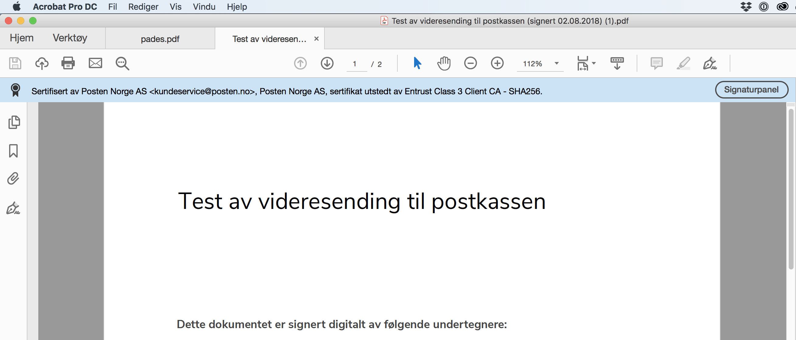
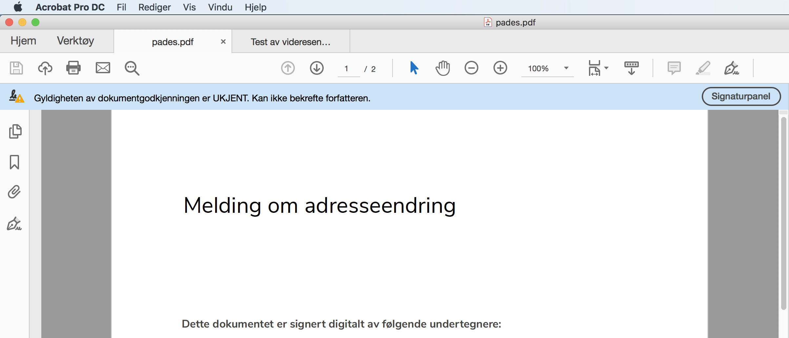
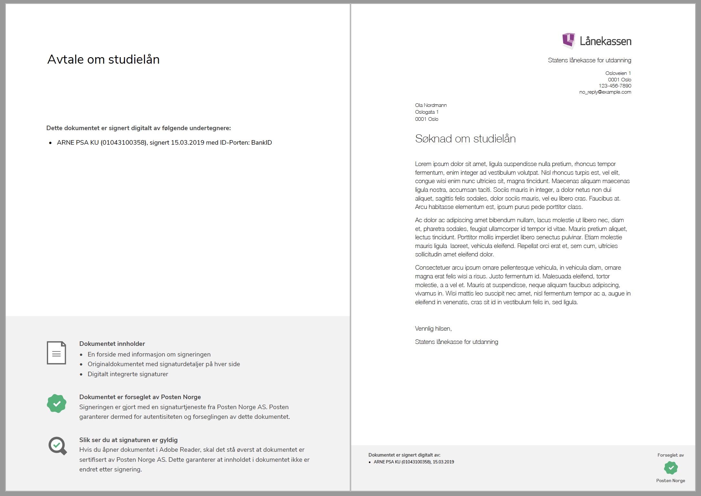

..  _signed-documents:

Signed documents
====================
With a digital signature, documents can be signed electronically by using verification of a person's identity and linking this with one or more documents. For signed PDF documents, the signature data is contained in the file itself, and many PDF readers have the option of displaying the digital signature.

..  NOTE::
  The signed document will only include information about the signers and the content of the document. It will not include any information about the sending organization. If the document needs to be signed by the organization as well, a signer from the organization must be addressed as well. 

When signing has been completed, we receive a *technical signature* and a *signed PDF*.

A technical signature is an XML file called *XML Advanced Electronic Signature (XAdES)* and is the proof that you have signed digitally. XAdES contains data to verify who signed, the time of signing, which signing method was used, the IP address used by the signer, and whether the document has been changed since the time of signing.

A signed PDF is called *PDF Advanced Electronic Signature (PAdES)*. This consists of the original document, a front page with information about the signing, **and** the technical signatures (the XAdES) for all of the signers. The XAdESes are digitally integrated into the PAdES and are not visible, but the files can be opened in the PDF reader's signature panel. So a signed PDF with three signers will contain the original document, a front page with information about the signing, and three XAdESes digitally integrated into the document.

All documents can be downloaded during a period after the signature task is completed. The lifetime depends on whether :ref:`long-term-validation-and-storage` have been activated for the sender.

..  _identify-signers:

How are signers identified in a signed document?
------------------------------------------------------------------

When the signature request is created, the sender can choose how the signers are to be identified in the signed documents.
The sender chooses to include one of the following identifiers in signed documents:

When the sender is a private organization:

- Name + national identity number
- Name + date of birth

When the sender is a public organization:

- Name + national identity number
- Name + date of birth (only available for :ref:`advanced-signature`)
- Name (only available for :ref:`authenticated-signature`)

..  CAUTION::
  If you want the signer’s national identity number to be shown on the signed document, for privacy reasons you must address the signer by national identity number in the signature request.

  If you omit the national identity number from the signed documents, we will not be able to verify the signer's identity with 100% certainty [#fotnotePåviseIdentitet]_. In the majority of cases, however, we can obtain sufficient verification based on the context in which the signing takes place.

  For example, there is very little probability that two people named Kari Olsen sign an apprenticeship contract with Lærlingebedrift AS at precisely the same time. In addition, technical evidence and other external circumstances such as customer relations or information in the document will also support verification of the signer's identity.

The signed document
========================

As shown below, the document will have a front page showing who has signed it and what the document contains. Each page also contains a footer that shows who has signed.

|pades-visning-adobe-innhold|

In a production environment
---------------------------
If the document is signed in a production environment, the signature can be verified in e.g. Adobe Acrobat Reader by clicking on *Signature panel* in the blue info box.

|pades-visning-adobe-prod|

In a test environment
---------------------
If the document is signed in a test environment, it is technically not a valid signature since certificates from a test issuer are used. This can be seen in the blue info box. It is nonetheless still possible to view the signatures as in the production environment.

|pades-visning-adobe-test|

Signature format
=====================

By signature format we mean the format of the object created through the signing process. The electronically signed document is normally stored in a different document format than the original document that was signed. Posten signering supports the following signature formats that are widely used in Norway today. This includes the formats supported directly by the e-ID providers, as well as formats provided by Posten signering via packaging.

**SEID-SDO**: SEID-SDO is an extension of ETSI (the European Telecommunications Standards Institute) CAdES/XAdES

**LTV-SDO**: Designation of an SDO (Signed Data Object) that has been expanded with long-term validation (LTV) data. LTV-SDO is an XAdES

**PAdES**: PAdES is a signature format containing the original document, all signatures and all information necessary to validate the signature. The format is specified by ETSI and is based on PDF. A PAdES can be opened in any PDF reader. Adobe Reader (and any other advanced PDF readers) will also be able to display parts of the validation information, so that the end user can see that the document has a valid signature.

Packaging of signatures
===========================

Posten signering packages signatures via a long-term validation format called LTV-SDO. LTV-SDO is an XAdES used to strengthen and standardize the signatures that come from e-ID providers. Even though LTV-SDO is a format developed primarily for long-term validation, it also has other features that make it appropriate to use for ordinary processing and storage of signed documents. This means that Posten signering and service providers only have one format to deal with, regardless of which e-ID provider is used for signing and whether the document is to be long-term validated or not.

Packaging takes place in two steps:

#. Packaging of SDO for LTV-SDO. Here, the signature is expanded and strengthened to facilitate long-term validation and to strengthen its value as evidence.
#. Packaging of LTV-SDO for PDF/PAdES. Here, support for multi-signature, user-friendliness and easier manual and mechanical processing by the recipient is added.

This packaging offers a number of advantages:

1. **User-friendliness**: Packaging for PDF/PAdES enables the user to view the signed document with signature attached. An important part of the signature ceremony is that human users receive this copy.
2. **Multi-signature – multiple signers**: Packaging for PDF/PAdES provides for a single data object for multiple signers on the same document. It will also display the signatures in a user-friendly way, so that you can see more signatures on the same document.
3. **Multi-signature - several signed documents**: Packaging for PDF/PAdES makes it possible to combine several signed documents that belong together in one common data object.
4. **Common format for all e-ID providers**: Packaging for LTV-SDO or for PAdES provides a consistent signature format regardless of the e-ID provider's format.
5. **Document processing in case and archive systems**: Packaging for PDF/PAdES allows for further processing in standard document systems, because a PAdES is also a PDF.
6. **End user signature validation**: Packaging for PAdES will allow validation of the document with a standard off-the-shelf product (e.g. Adobe Reader), if it is signed (sealed) with a certificate recognized by the reader.
7. **Long term storage (LTV)**: Packaging for LTV-SDO or PAdES provides the best long-term validation support. :ref:`long-term-validation-and-storage`, regardless of whether this is in the central archiving service or at the customer, requires a format that supports preservation and storage of validation data. The underlying SDO from the e-ID provider is available in the LTV-SDO format and can be easily retrieved as required. The service can therefore offer customers the enriched LTV-SDO, as well as access to the underlying SDO from the e-ID provider. It is not a prerequisite that the customer can handle LTV-SDO, but rather a recommendation that will ensure standardized access to enriched and integrity-protected information about the signature request.

Packaging with XAdES and/or PAdES will take full advantage of the standardization work concerning preservation conducted under the auspices of the EU (XAdES Baseline developed by the EU's DSS initiative, which will be the preferred standards in XAdES).

..  rubric:: Footnotes

..  [#fotnotePåviseIdentitet] The signed document contains an anonymized identifier that identifies the signer with 100% accuracy at the e-ID provider, for example at BankID. This requires e-ID look-up by the provider and is only supported for advanced signatures.
